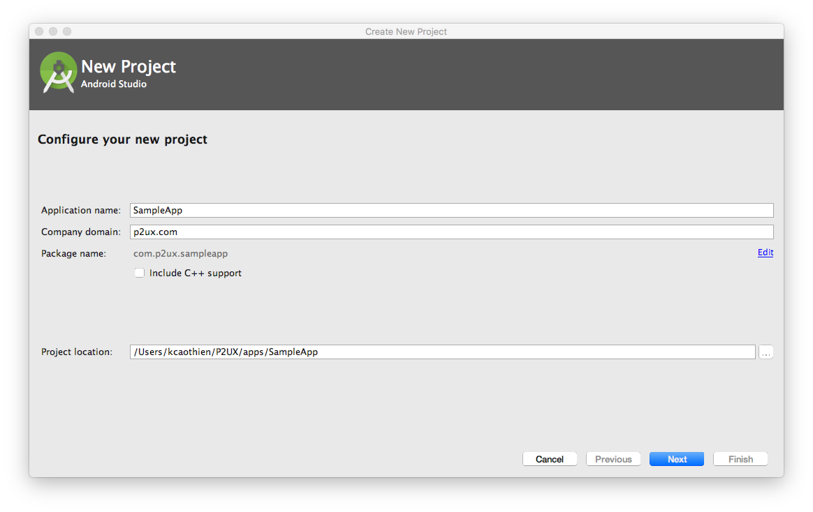
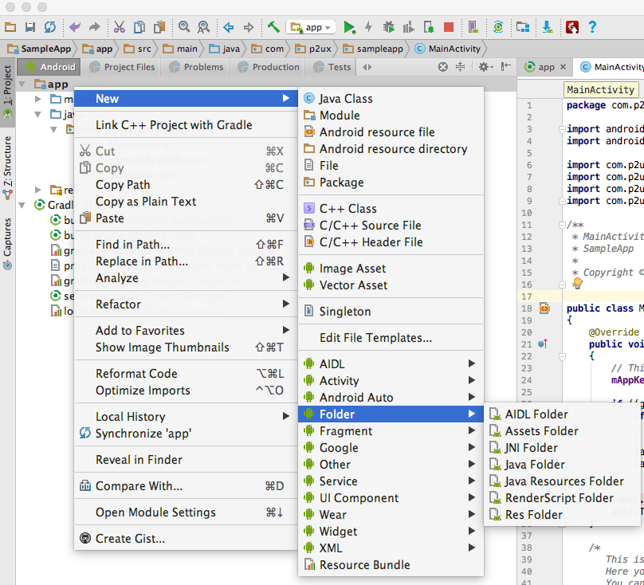
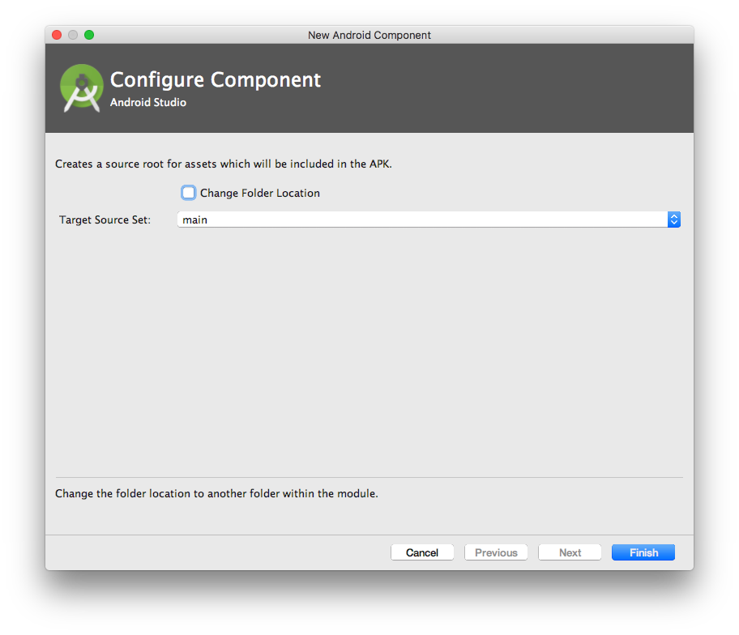

## Introduction


What follows is a detailed tutorial that walks developers through all of the steps involved in creating a customizable Android application using P2UX. Developers should be familiar with the Android Studio integrated development environment and the Java programming language for custom coding.

!!! note "Terminology"
    Throughout the P2UX documentation the “developer” refers to you, the reader who is developing an app with P2UX. The “designer” refers to the individual whose principal job is to create the appearance and style of the app and its visual components. “PRL” refers to the P2UX Rendering Library for Android, which controls the creation and workflow of content created for the P2UX platform.

!!! note "Coding examples and code additions"
    In the coding examples below and throughout the documentation, changes and additions to be made by the developer are rendered with a blue highlight.

*P2UX versus the standard Android Studio environment*

P2UX based applications are easy to customize and extend for Android. The P2UX Android rendering library is based on the Android Widget package (android.widget) and other Android primitives. This means that writing custom business logic and integrating custom controls works much the same as it does when writing Android applications using Android Studio.
With the P2UX platform, XML Layout files are no longer required for Android development. Instead, applications use P2UX Portable UX Bundles (PUB) either as embedded or dynamically accessed resources. Additionally, P2UX provides hooks to developers that allow them access to all of the components of P2UX as well as the ability to fully customize instances of the application.

## Getting Started with P2UX and Android Studio

*Java*

P2UX native rendering libraries for Android can be extended using the Java programming language. The instructions below provide explicit reference to the proper use of Java coding in each applicable step that follows.

### Creating a new application

From Android Studio environment:

* Start the Android Studio new project wizard either from the Welcome to Android Studio screen by clicking ‘Start a new Android Studio project’ or by selecting File->New->New Project.
* From the new project wizard enter your application name, company domain, and project location.

* In the Target Android Devices window, set the minimum SDK to API 18: Android 4.3 (Jelly Bean).
* In the Add an Activity to Mobile window, select the Empty Activity.
* In the Customize the Activity window, uncheck the ‘Generate Layout File’ option.

###P2UX libraries download and PUB hook up
The next step in developing your project with P2UX is to include the P2UX libraries (AAR) for Android. The latest libraries can be downloaded from here. After downloading the libraries, make the following changes to hook up the PUB for the application:

* Unzip the library file.
* Create a subdirectory under the root of your project directory, i.e. ‘p2ux’
* Copy P2UXCore.aar and P2UXApp.aar files into the subdirectory, ‘p2ux’.
* Edit the app’s build.gradle (Module: app) to look like this:

``` hl_lines="24 31 32 33 36 37 38 39 40 41"
apply plugin: 'com.android.application'

android {
   compileSdkVersion 26
   buildToolsVersion "26.0.2"
   defaultConfig {
       applicationId "com.p2ux.sampleapp"
       minSdkVersion 18
       targetSdkVersion 26
       versionCode 1
       versionName "1.0"
       multiDexEnabled true
   }
   buildTypes {
       release {
           minifyEnabled false
           proguardFiles getDefaultProguardFile('proguard-android.txt'), 'proguard-rules.pro'
       }
   }
}

repositories {
   mavenCentral()
   flatDir { dirs '../p2ux' }   // Replace this directory with the location of P2UX libraries
}

dependencies {
   compile fileTree(dir: 'libs', include: ['*.jar'])
   compile 'com.android.support:appcompat-v7:26.1.0'

   compile(name: 'P2UXCore', ext: 'aar')
   compile(name: 'P2UXApp', ext: 'aar')
   compile 'com.android.support:recyclerview-v7:26.1.0'
   // If Google Maps are required for your app, add the following 4 Google Play 
   // Services dependencies
   compile 'com.google.android.gms:play-services-maps:11.6.2'
   compile 'com.google.android.gms:play-services-ads:11.6.2'
   compile 'com.google.android.gms:play-services-identity:11.6.2'
   compile 'com.google.android.gms:play-services-gcm:11.6.2'
   compile 'com.madgag.spongycastle:core:1.54.0.0'
   compile 'com.madgag.spongycastle:prov:1.54.0.0'
}
```

## Moving the app from Builder to Android Studio

* App License and Android App Activity class

Android Studio automatically generates an app activity class when you create a project. Unless you rename the file, the app activity file is named `MainActivity`. 
Edit the `MainActivity` file to look like this:

``` Java hl_lines="3 4 5 6 8 15 16 17 18 19 20 21 22"
import android.os.Bundle;

import com.p2ux.app.P2UXAppCreator;
import com.p2ux.app.P2UXAppFragmentActivity;
import com.p2ux.app.components.P2UXAppBehavior;
import com.p2ux.core.utils.P2UXLog;

import java.util.ArrayList;
import java.util.HashMap;

public class MainActivity extends P2UXAppFragmentActivity
{
   @Override
   public void onCreate(Bundle savedInstanceState)
   {
        super.onCreate(savedInstanceState);
        // You can get the app key or license key from builder for your app. This is required to link your builder up to your local app
        // This is the key generated from Builder for the application. This key is needed to initialize the P2UX rendering framework.
        String appKey = "xxxxx"; 
        HashMap<String, Object> options = new HashMap<>();
        if ((getApplicationInfo().flags & ApplicationInfo.FLAG_DEBUGGABLE) == ApplicationInfo.FLAG_DEBUGGABLE) {
	    options.put(P2UXAppCreator.P2UXAppCreator_Opt_Env, P2UXAppCreator.P2UXAppCreator_Opt_Env_Recent);
            options.put(P2UXAppCreator.P2UXAppCreator_Opt_LogLevel, P2UXLog.P2UXCoreLogFlagVerbose);
        }
        super.setupApp(savedInstanceState, appKey, options, null);
   }
}
```
Next, retrieve the app’s license. In Builder, to the right of the publish button are further options in a drop-down menu. Select ==“Get App License”== from the menu and a window will pop up with your app’s license. Copy the license. The `MainActivity` calls the super.OnCreate() with the `mAppKey`. This initializes the PRL with the application information. In this example, options supplied to the savedInstanceState variable use the prototype version of the application when the application is compiled for debugging. To use the production version of the application, remove the section that checks for `FLAG_DEBUGGABLE`.


In `MainActivity`, replace the ==“xxxxxx”== in the line that reads ==“mAppKey = “xxxxxx”;== with the app’s license you just retrieved from Builder to finalize the initial app setup in P2UX.

!!! note
	At this point the application setup is complete and the app should run successfully.

## The PUB and network connectivity

The next step in the process requires developer awareness of the default PUB status and access to a network.

By default, the application accesses the PUB dynamically. This means that when the application is first installed, the P2UX rendering library (PRL) will authenticate the application key and then download the PUB before running the application content.

The first run of an application requires network connectivity. Otherwise, P2UX will return an error. The PUB’s default update policy is automatic. This means that the PRL will automatically check for updates each time the application runs. The library will also download any updates that are available, and then notify the user that the application will restart to apply any updates.

### Static Assets

In some cases, a developer may opt to use only static assets rather than require network access for an app. In this situation, the PUB can be added to the application as a collection of static assets. Additionally, other static assets usable by the app can be added to an Android project. To achieve this, follow these steps:

!!! note
    This feature requires downloading your application PUB from Builder. This feature will be integrated as part of the P2UX Coordinator application for Mac OS

* In Builder, download the published PUB for application
    * Steps to download PUB will go here
* Unzip the PUB files and copy the assets into a folder inside your project directory.
* In Android Studio, add the assets folder to the project.
    * From the Android project navigator, select the app module folder.
    * Right click and select ==New->Folder->Assets== Folder.

    * From the `Configure Component` dialog, click ==Finish==. This creates a folder named `assets` under your app main folder.

    * Rename the folder containing the PUB assets to something more readable such as `phone_pub`.
    * Move the ‘phone_pub’ folder to the ‘assets’ folder.
    
In order to incorporate these files into your project, as well as to adjust the resource use settings, you must change the Activity file. Edit the `MainActivity` file to look like this:

``` Java hl_lines="6 7 8 9 10 11 12 13 14 15 16 17 18"
@Override
public void onCreate(Bundle savedInstanceState)
{
    super.onCreate(savedInstanceState);
    
    String appKey = "xxxxx"; 
    ArrayList<HashMap<String, Object>> resources = new ArrayList<>();
    // Set up external resource
    HashMap<String, Object> phoneRes = new HashMap<>();
    phoneRes.put(P2UXAppTypes.P2UXApp_PackageAttrib_FormFactor, 0);
    phoneRes.put(P2UXAppTypes.P2UXApp_PackageAttrib_Type, P2UXAppTypes.P2UXApp_PackageType_Static);
    phoneRes.put(P2UXAppTypes.P2UXApp_PackageAttrib_Package, "shellui_phone");
    phoneRes.put(P2UXAppTypes.P2UXApp_PackageAttrib_Update, P2UXAppTypes.P2UXApp_PackageUpdate_None);
    resources.add(phoneRes);
    super.setupApp(savedInstanceState, appKey, options, null);
}
```

### Defining Custom Resource Attributes

If desired, the developer can define specific resource attributes for the app.

The resources parameter is an array of objects. Each object in the array defines the PUB usage for a particular form factor (Phone, Tablet, TV) using key value pairs. If the application supports multiple form factors, create an object in the resources array for each form factor.

Customize the resource attributes according to the possibilities below:

| Resource Attribute | Description |
| --- | --- |
| P2UXApp_PackageAttrib_FormFactor | Defines which form factor the attributes reference.<br/><br/>**Possible Values:**<br/>P2UXFormFactor_Phone<br/>P2UXFormFactor_Tablet<br/>P2UXFormFactor_TV |
| P2UXApp_PackageAttrib_Type | Defines the type of resources for the form factor<br/><br/>**Possible Values:**<br/>P2UXApp_PackageType_Static<br/>P2UXApp_PackageType_Remote |
| P2UXApp_PackageAttrib_Package | Defines the name of the folder within the application bundle containing assets when the P2UXApp_PackageAttrib_Type is P2UXApp_PackageType_Static. |
| P2UXApp_PackageAttrib_Update | Defines how to update the application assets<br/><br/>**Possible Values:**<br/>P2UXApp_PackageUpdate_None<br/>P2UXApp_PackageUpdate_Auto<br/>P2UXApp_PackageUpdate_Manual |
