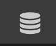
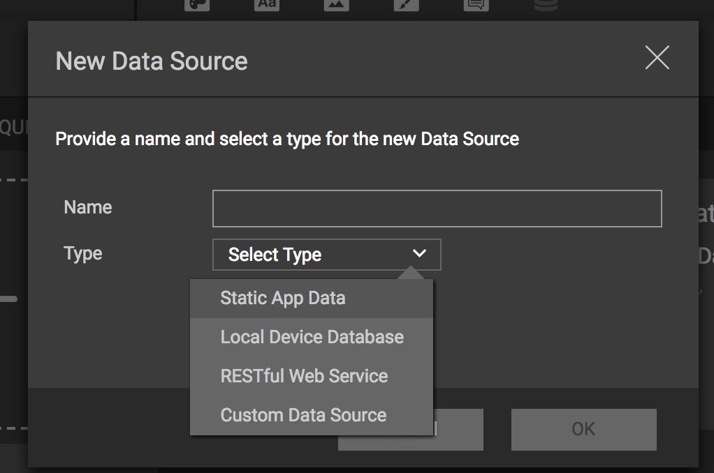

# Data Sources
Data Sources are collections of data that can be served from a variety of sources. P2UX Data Sources provide a consistent interface for accessing data and allows the data to be used directly in UI. It can also be parameterized using arguments for query purposes. 

Data Sources consist of a JSON specification defining the requests and the structure of the data for the request as well as an implementation in code for the specific client rendering libraries. 

## Types of Sources
P2UX provides a number of sources that can be used via *Builder* without having to write any code on either of the respective client platforms.

* [Static Data](staticdatasource.md)
* [Local Data](localdatasource.md)
* [RESTful Data](restdatasource.md)

In addition to these basic data sources, developers can provide custom sources of data in code by wrapping the data functionality in the P2UXDataSource protocol.

!!! note
    As of the last version of this document, the specification for Data Sources can only be defined using a JSON editor in *Builder*. It is assumed that the reader understands the basics of JSON structure to be able to edit the data source. A better targeted Data Source editor is being developed to make creation of Data Sources simpiler. 

## Data Source Specification
All Data Sources in P2UX have a specification (based on JSON) that is defined as part of the application in *Builder*. The specification defines the Data Source's unique identifier and name, the type of data source and the requests that are used by the application to access the data.

### Basic Attributes

| Attribute | Type | Description | 
| --- | --- | --- |
| name | Object | The localized name of the data source. |
| type | String | The type of the data source. The basic types provided by P2UX are:<br>**LOCAL, STATIC, REST**<br><br>For custom data sources, create a unique type value. This value is used to represent the class instance to be created in the client renderer.<br>Example: `MQTT` |
| systemtype | String | The system name for the data source. This is the value that is used by the rendering library to identify the data source for data linking. When a Data Source is duplicated, this value will not change so that the P2UX rendering libraries can still identify the Data Source for data linking and events.
| requests | Object | The requests for the data source. The key is the identifier of the request. [See Requests Objects Attributes](#requests-object-attributes) for more details on the Request object contents. |
| initdata | Object | (OPTIONAL) - Object that defines global data necessary either across all requests or to be utilized before any requests are made. The format of this is specific to the type of the data source. |
| description | Object | (OPTIONAL) - The localized description of the data source. |

### Requests Object Attributes
Each key in the `requests` object represents the name for a particular request within the datasource. The associated value is itself an object consisting of a `request` object and a `schema` object. 

| Attribute | Type | Description |
| --- | --- | --- |
| schema | Object | The schema that defines the structure of the request data. |
| request | Object | The request contains attributes defining details of the request. The attributes supported are specific to the request type. See [Requst Object Attributes](#request-object-attributes) |


### Request Object Attributes
The `request` object contains information about how to fulfill the request and persist the results for the request in the app. 

| Attribute | Type | Description |
| --- | --- | --- |
| attributes | Object | (OPTIONAL) - This object consists of configuration attributes for the request and it's returned data. |
| version | Integer | (OPTIONAL) - This is the version number for this request. if it is missing then it is assumed to be 0. The version number is used to indicate an incompatible change to a request such as a change in schema structure. When this number is modified it effectively invalidates any persisted results for the request causing new requests to act as if it is being made for the first time. |
| format | String | (OPTIONAL) - This is string indicating the format of data for the request. Currently only "JSON" is supported. This is the default if the attribute is not specified. |
| args | Object | (OPTIONAL) - Each attribute in this object represents a parameter to be passed to the request along with its associated value. These args are merged with (or overridden by) parameters specified at the time the request is made either via an event action or a data link. Details of how the parameters are processed is determined by the specific type of datasource.  

### Schema Object
The `schema` object specifies the structure and type of data returned that the request returns.

Every item in the schema is an object that has at least a `type` and if its an `Object` or an `Array`, it requires an `item` that defines the details of the item.

**Supported Types:**

| Type | Description |
| --- | --- |
| Number | An integer or a float value |
| String | A string value | 
| Date | Represents a timestamp as an integer value representing the seconds since January 1 1970.<br><br>It can also be a string in the following formats:<br>`yyyy-MM-dd'T'HH:mm:ssZZZZZ`<br>`yyyy-MM-dd'T'HH:mm:ss`<br>`yyyyMMdd'T'HH:mm:ss`<br> |
| Object | An object made up of key / value items. |
| Array | An array of items. Arrays support an additional attribute `index` value that can be used to list the field of the object in the array that represents the index value of the object. |

Example Schema: 
```
  "schema": {
    "type": "Array",
    "index": "ident",
    "item": {
      "type": "Object",
      "item": {
        "ident": {
          "type": "String"
        },
        "firstname": {
          "type": "String"
        },
        "lastname": {
          "type": "String"
        },
        "email": {
          "type": "String"
        }
      }
    }
  }

```
Matching Data:
```
[
  {
    "ident":"dd1b366e-d619-4d8c-a9d0-201868744f6a",
    "firstname":"Joe",
    "lastname":"Snow",
    "email":"joe.snow@mail.org"
  },
  {
    "ident":"a5fd4f0a-baba-4a9b-b278-8894a7385d61",
    "firstname":"Jane",
    "lastname":"Doe",
    "email":"jane.doe@mail.org"
  }
]
```

## Creating Data Sources
*Builder* has a basic JSON interface (as of this article's writing), that allows for creation of a Data Source. The Data Source specification is separated into logical requests. Each request has a schema that defines the data structure and request parameters.

To Create a new Data Source in *Builder*:

* Make sure you are in the Application or Screen/Panel Editor for your application.
* Click on the Data Source Icon from the top tool bar<br>

* In the ==Manage Data== dialog, click the ==+== button to create a new data source.
* From the ==Add Data Source== dialog, click the ==+== to the right of the ==Select Data Source== drop down.
* In the ==New Data Source== dialog, type in a name for the data source and then select the type of Data Source to create from the ==Select Type== drop down.

* Click ==OK== to save the new data source.

The newly created data source is now part of the application.<br>*Builder* will create the basic entries needed for the Data Source. It is up to the user to create the specific *requests* that define the data repository. 

## Creating a Request
Once a Data Source has been created, *requests* can be added that represent logical repositories of data. Each request requires a *schema* and a *request* object that define the request details. The *schema* object defines the structure of the data. The *request* object defines the version of the request schema and any other attributes about the request (See Data Source Requests for more information). The details of the `request` object for the different types of Data Sources can be found in the documentation for those specific Data Source types.

To Create a new Request in *Builder*:

* Make sure you are in the Application or Screen/Panel Editor
* Click on the Data Source Icon from the top tool bar<br>

* In the ==Manage Data== dialog, click the ==edit== button overlay (or double click) on the Data Source from the list.

In the ==Edit JSON== dialog, there will be a JSON node named ==requests==.

Create a new key under the requests object that is the name of the request. The object associated with the key will contain the *schema* and the *request* attributes.

<div style="text-align:right"><sub><sup>Last Updated: Jan. 2, 2018<sup><sub></div>
