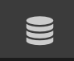

# Static Data Sources
Static Data Sources are repositories of data that are bundled into the application as a read-only resource. Since it follows the standard Data Source protocol, data from the repository can be used directly in UI and can also be parameterized using arguments for query purposes. Think of it as a catalog of data available to your application. 

!!! note
    As of the last version of this document, Data Sources can only be defined using a JSON editor. It is assumed that the reader understands the basics of JSON structure to be able to edit the data source. A better targeted Data Source editor is being developed to make creation of Data Sources simpiler. 

## Request Object Attributes
Static Data Sources have a few extra attributes used for the data and parameters. In addition to the standard [Request Object Attributes](datasource.md#request-object-attributes):

| Attribute | Type | Description |
| --- | --- | --- | 
| data | mixed | This item defines the actual data returned by the request when there are no parameters provided. The data type depends on the `schema` for the request. |


## Creating Static Data Sources
Static Data Sources follow the standard model of Data Sources in the P2UX environment (*[see Data Sources Overview for more details](overview)*). Data is separated into logical requests. Each request has a schema that defines the data structure and the data.

To Create a new Static Data Source in *Builder*:

* Make sure you are in the Application or Screen/Panel Editor
* Click on the Data Source Icon from the top tool bar<br>

* In the ==Manage Data== dialog, click the ==+== button to create a new data source.
* From the ==Add Data Source== dialog, click the ==+== to the right of the ==Select Data Source== drop down.
* In the ==New Data Source== dialog, type in a name for the data source and then select ==Static App Data== from the ==Select Type== drop down.

* Click ==OK== to save the new data source.

The newly created data source is now part of the application.

## Defining a Request
Once a Static Data Source has been created, *requests* can be added that represent logical repositories of data. Each request requires a *schema* and a *request* object that define the request details. The *schema* defines the structure of the data. The *request* defines the data stored in the request as well as parameterized data if necessary.

To Create a new Request in *Builder*:

* Make sure you are in the Application or Screen/Panel Editor
* Click on the Data Source Icon from the top tool bar<br>

* In the ==Manage Data== dialog, click the ==edit== button overlay (or double click) on the Static Data Source from the list.

In the ==Edit JSON== dialog, there will be a JSON node named ==requests==.

Create a new key under the requests object that is the name of the request. 

### Basic Data Request
This example shows a request with basic data. The request is called `info` in a data source named `Internal Data`. The `data` object in the request defines the data that will be returned when the request is called. 

This particular example request contains an object that defines information about a fictitious business. 
``` hl_lines="8"
{
  "name": {
    "en_US": "Internal Data"
  },
  "type": "STATIC",
  "systemtype": "internal_data",
  "requests": {
    "info": {
      "schema": {
        "type": "Object",
        "item": {
          "opentime": {
            "type": "String"
          },
          "closetime": {
            "type": "String"
          },
          "phonenum": {
            "type": "String"
          },
          "address": {
            "type": "String"
          },
          "state":{
            "type":"String"
          },
          "city":{
            "type":"String"
          }
        }
      },
      "request": {
        "data": {
          "address":"1234 Somewhere St.",
          "city":"Santa Clara",
          "state":"CA",
          "phonenum":"555-555-5555",
          "closetime":"7:00pm",
          "opentime":"9:30am"
        }
      }
    }
  }
}
```

### Parameterized Data Request
Static data can also include arguments to create queryable data. Parameterized data is defined in a `paramdata` object in the request. When arguments are provided to the request, the data is found by matching the arguments provided with the key value in the `paramdata`. The other required object definition is a `params` array that has objects defining each of the parameters to the request.

!!! note
    A request can have both default unparameterized as well as parameterized data.
    
#### Request Object Attributes for Parameterized Data
The following attributes are additional Request Object Attributes that are part of the `request` definition for parameterized data:

| Attribute | Type | Description |
|---|---|---|
| params | Array | An array of objects that define each parameter available to the request. *(See Params Array Object for more Information)* |
| paramdata | Object | An object that defines each possible parameter value and its associated `data`. The `data` item beneath each parameter value follows the `data` definition for default data |
|
#### Params Array Object
Each item in the Params array for a request follow this structure:

| Attribute | Type | Description | 
| --- | --- | --- |
| name | String | The name of the parameter. This is the only required item in the specification |
| required | Boolean | (OPTIONAL) - Whether or not this parameter item is required to be provided by the requestor. If it is required, and the parameter is not supplied, the request will not complete successfully |
| default | String | (OPTIONAL) - An default value to use if the parameter is not supplied as part of the request. | 

Below is an Example of a request called `colors` in a data source named `Internal Data`. The argument to the request is named `color` which is the color name and the results are color values. `params` defines the parameter `color`. The `paramdata` object defines the results for the primary argument `color` and each possible argument value for `color` (*blue* & *red*)
```
{
  "name": {
    "en_US": "Internal Data"
  },
  "type": "STATIC",
  "systemtype": "internal_data",
  "requests": {
    "colors": {
      "schema": {
        "type": "Object",
        "item": {
          "color": {
            "type": "String"
          },
          "name":{
            "*":"String"
          }
        }
      },
      "request": {
        "data": {
          "color":"#ffffff",
          "name":{
            "en_US":"Default"
          }
        },
        "params":[
          {
            "name":"color"
           }
        ],
        "paramdata":{
          "color":{
            "blue":{
              "data":{
                "color":"#0000ff",
                "name":{
                  "en_US":"Blue",
                  "de_DE":"Blau"
                }
              }
            },
            "red":{
              "data":{
                "color":"#ff0000",
                "name":{
                  "en_US":"Red",
                  "de_DE":"Rot"
                }
              }
            }
          }
        }
      }
    }
  }
}
```
<div style="text-align:right"><sub><sup>Last Updated: Dec. 22, 2017<sup><sub></div>
