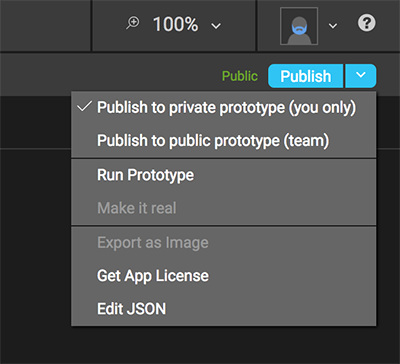
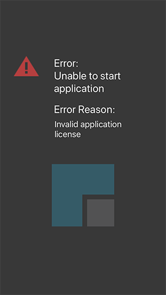

# Application License

All applications using the *P2UX Rendering Library (PRL)* are required to initialize the *PRL* with an application license. This license is used to identify the application and authenticate with *Builder* when fetching application bundles. 

## Online Use
The default method of initializing the *PRL* is to provide the application license as a string to the `P2UXAppCreator` at startup. When providing the license as a string, the application must contact *Builder* the first time the application is run to authenticate the license and download the details of the license. The license details are stored securely on the device and provide the *PRL* the information needed to get an application started. Once the license has been fetched successfully, the PRL does NOT need to authenticate with *Builder* for subsequent launches of the application. It only needs to authenticate once during the installed lifetime of the application.

To retrieve the application license in *Builder*:

* From the ==Publish== drop down menu, click the ==Get App License== menu item.

* A dialog will show with your app’s license. Copy the license.

!!! note "*Coordinator* for macOS"
    If you have created your application with the P2UX *Coordinator* application for macOS, this step is not required as the license string is automatically fetched and inserted into your code when the project is created.

Once the license string is copied, it can be used in the native application code to initialize the *PRL*

### iOS/tvOS

#### Objective-C
In `AppDelegate.m`:
``` Objective-C hl_lines="4"
- (BOOL)application:(UIApplication *)application didFinishLaunchingWithOptions:(NSDictionary *)launchOptions {
    
    // Include your application license string here
    NSString* appKey = @"000x.xxxxxxxx";
    NSDictionary* opts = nil;
#ifdef DEBUG
    opts = @{P2UXAppCreator_Opt_Env: P2UXAppCreator_Opt_Env_Stage, P2UXAppCreator_Opt_LogLevel:[NSNumber numberWithInteger:P2UXCoreLogLevelVerbose]};
#endif

    [P2UXAppCreator createApplicationWithKey:appKey opts:opts resources:nil delegate:self];
    return YES;
}
```

#### Swift
In `AppDelegate.swift`:
``` Swift hl_lines="4"
func application(_ application: UIApplication, didFinishLaunchingWithOptions launchOptions: [UIApplicationLaunchOptionsKey: Any]?) -> Bool {
       
    // Include your application license string here  
    let appKey = "000x.xxxxxxxx";

    var opts : [AnyHashable : Any];
#if DEBUG
    opts = [
            P2UXAppCreator_Opt_Env: P2UXAppCreator_Opt_Env_Stage,
            P2UXAppCreator_Opt_LogLevel: P2UXCoreLogLevel.verbose.rawValue as NSNumber
    ]
#endif
        
    P2UXAppCreator.createApplication(withKey: appKey, opts: opts, resources: nil, delegate: self)
    return true
}
```

### Android
In `MainActivity.java`:
``` Java hl_lines="5"
@Override
public void onCreate(Bundle savedInstanceState)
{
    // Include your application license string here  
    mAppKey = "000x.xxxxxxxx";
    
    if ((getApplicationInfo().flags & ApplicationInfo.FLAG_DEBUGGABLE) == ApplicationInfo.FLAG_DEBUGGABLE)
    {
        if (savedInstanceState == null)
        {
            savedInstanceState = new Bundle();
        }
        savedInstanceState.putString(P2UXAppCreator.P2UXAppCreator_Opt_Env, P2UXAppCreator.P2UXAppCreator_Opt_Env_Stage);
        savedInstanceState.putLong(P2UXAppCreator.P2UXAppCreator_Opt_LogLevel, P2UXLog.P2UXCoreLogFlagVerbose);
    }
    super.onCreate(savedInstanceState);
    applyTranslucentStatusBar();
}
```

## Offline Use
For the case where the developer does not want to require network connectivity on the first run of the application, the application license can be downloaded from *Builder* and embedded into the native application bundle. Once the file is downloaded, it can be added to your project. The *PRL* will look for a license file within your application before it attempts to download the license from *Builder*.

To download the application license file from *Builder*:

* From the ==Publish== drop down menu, click the ==Get App License== menu item.

* A dialog will show with your app’s license. From the dialog click the ==Download== button.
* *Builder* will download a file named `P2UXLicense.json` to your computer. 

!!! important
    If for some reason your browser gives the downloaded license file a different name than `P2UXLicense.json`, the file will need to be renamed `P2UXLicense.json` before using it *(the name IS case sensitive)*. The *PRL* will look for a file with this name in the application resources on startup.


### iOS/tvOS

* Copy the `P2UXLicense.json` into your project directory.
* In Xcode, right click on the project folder and select ==Add Files to '*(project name)*'==
* Select the `P2UXLicense.json` from the file system directory it was copied to.

### Android

* Create a file system directory named `assets` in your project inside the project subdirectory `app/src/main` (if it doesn't already exist)
* Copy the `P2UXLicense.json` file into the `assets` directory.

## Errors with the License
If the license fails to authenticate, the PRL will display an error message at startup. This error message screen can be customized by the developer in native code (See Customizing Error Screens).



**Possible Errors:**

| Message | Description |
| --- | --- |
| Invalid application license | The provided license string is not valid. Check the value with the license string provided by *Builder* |
| Unable to retrieve license | The *PRL* is unable to contact *Builder* to validate the license. Check the connectivity of the device |

