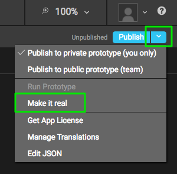
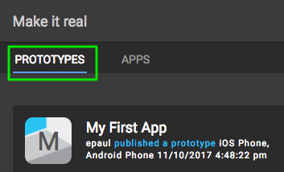
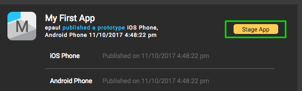
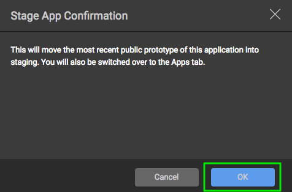
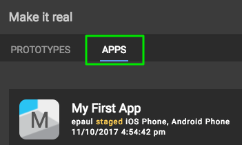

# Application Environments
-----

Publishing applications on the P2UX Platform allows for use in different environments to support prototype testing, staged testing for release to live applications, and deployment of the application content to production native apps. Each environment can be targeted by the native application based on the creation and initialization of the app in native code. The use of these different environments is not enforced by the P2UX rendering libraries (PRL) on the different platforms which allows the developer to decide how they are used.

When using application bundles as dynamic resources, P2UX based native applications will check for updates to the application bundle on startup of the app.

## Environments
There are three environments for applications to make use of: *Prototype, Stage, Deployed*. Applications are promoted from one stage to another via the *Builder* application. Native applications can toggle the environment used programmatically so that the application can be tested using the different environments prior to release to production.

### Prototype
When an application is Published via the ==Publish== menu in *Builder*, the application contents are compressed and bundled into packages for use on the specified platforms and form factors. These published versions of the application are *Prototypes* of the application. The primary use of *Prototypes* is to try out UI variations, workflow, and even custom code. 

!!! note "Private and Public Publishing"
    *Builder* provides the option to publicly or privately publish prototypes. A private publish of the Prototype is only available to the user that Published the application and will only be usable by the *P2UX Player* for Android and iOS/tvOS. A public publish of the application will be available in the *P2UX Player* to any user in the same group as the user that published the application as well as being available for use in native application instances.

To use a *Prototype* in a native application, the developer needs to setup the PRL environment to refer to prototypes. 

The environment value to use for Prototypes is: `P2UXAppCreator_Opt_Env_Recent`

This setting will fetch the most recent *Public* version of the Application bundle regardless of whether it is in the *Prototype*, *Staged*, or *Production* environments. Every time the application is published publicly, it becomes the most recent version and is available to developer builds of the application.

!!! danger "Prototypes aren't meant for Release!"
    Using a *Prototype* bundle with dynamic updates in a native application is supported by P2UX, but NOT recommended for applications released to the public. It is meant for developer builds try out features quickly and test your custom code. Be aware that every time a public pubish is performed on the application, the native application will pick up the changes when it restarts which means every change made to the application and published as a public *Prototype* would be pushed to your users! 

The following code examples set the environment to `P2UXAppCreator_Opt_Env_Recent` for developer testing and debugging purposes.
    
####iOS/tvOS
In Objective-C, edit `AppDelegate.m`:

``` Objective-C hl_lines="10"
#import "AppDelegate.h"
@interface AppDelegate ()
@end
@implementation AppDelegate
- (BOOL)application:(UIApplication *)application didFinishLaunchingWithOptions:(NSDictionary *)launchOptions {
    NSString* appKey;
    appKey = @"xxxxx";
    NSDictionary *opts;
#if DEBUG
    opts = @{P2UXAppCreator_Opt_Env: P2UXAppCreator_Opt_Env_Recent};
#endif    
   
    [P2UXAppCreator createApplicationWithKey:appKey opts:opts resources:resources delegate:self];
    return YES;
}
```

In Swift, edit `AppDelegate.swift`:
``` Swift hl_lines="12"
import UIKit
import P2UXApp

@UIApplicationMain
class AppDelegate: UIResponder, UIApplicationDelegate, P2UXAppCreatorDelegate {
    var window: UIWindow?
    func application(_ application: UIApplication, didFinishLaunchingWithOptions launchOptions: [UIApplicationLaunchOptionsKey: Any]?) -> Bool {
        let appKey = "xxxxx";
        var opts : [AnyHashable : Any];
#if DEBUG
        opts = [
            P2UXAppCreator_Opt_Env: P2UXAppCreator_Opt_Env_Recent,
        ]
#endif
        P2UXAppCreator.createApplication(withKey: appKey, opts: opts,
            resources: resources, delegate: self)
    }
    func createBehavior(forApplication appid: String) -> P2UXAppBehavior {
        return SampleBehavior();
    }
}
```

####Android
Edit `MainActivity.java`:
``` Java hl_lines="9"
@Override
public void onCreate(Bundle savedInstanceState)
{
   mAppKey = "xxxxx";      
   if ((getApplicationInfo().flags & ApplicationInfo.FLAG_DEBUGGABLE) == ApplicationInfo.FLAG_DEBUGGABLE) {
       if (savedInstanceState == null) {
           savedInstanceState = new Bundle();
       }
       savedInstanceState.putString(P2UXAppCreator.P2UXAppCreator_Opt_Env, P2UXAppCreator.P2UXAppCreator_Opt_Env_Recent);
   }

   super.onCreate(savedInstanceState);
}
```

### Stage
The *Stage* environment is intended for testing an application prior to its release to production. Once application content is staged, it will NOT pick up any changes from subsequent publishes of the application as a *Prototype*. Staged application content will also NOT be delivered to native applications using *Production* content.

To make application content available to the *Stage* environment in *Builder*:
    
* Click the ==Publish== menu dropdown and select ==Make it real== from the menu.


* Make sure you are in the ==Prototypes== tab at the top of the ==Make it Real== dialog


* Click the ==Stage App== button next to the Prototype application bundle. 


* Click ==OK== from the ==Stage App Confirmation== to finish the staging.


To use *Stage* content in a native application, the developer needs to setup the PRL environment to refer to staged content. 

The environment value to use for Prototypes is: `P2UXAppCreator_Opt_Env_Stage`

This setting will fetch the staged version of the Application bundle when the application starts if it doesn't already have the most recent version of the bundle. 

!!! danger "Staged content is for testing"
    Using a *Staged* bundle with dynamic updates in a native application is not recommended for applications released to the public. It is meant for testing an application's content changes prior to release.

The following code examples set the environment to `P2UXAppCreator_Opt_Env_Stage` for developer testing and debugging purposes.

####iOS/tvOS
In Objective-C, edit `AppDelegate.m`:

``` Objective-C hl_lines="10"
#import "AppDelegate.h"
@interface AppDelegate ()
@end
@implementation AppDelegate
- (BOOL)application:(UIApplication *)application didFinishLaunchingWithOptions:(NSDictionary *)launchOptions {
    NSString* appKey;
    appKey = @"xxxxx";
    NSDictionary *opts;
#if DEBUG
    opts = @{P2UXAppCreator_Opt_Env: P2UXAppCreator_Opt_Env_Stage};
#endif    
   
    [P2UXAppCreator createApplicationWithKey:appKey opts:opts resources:resources delegate:self];
    return YES;
}
```

In Swift, edit `AppDelegate.swift`:
``` Swift hl_lines="12"
import UIKit
import P2UXApp

@UIApplicationMain
class AppDelegate: UIResponder, UIApplicationDelegate, P2UXAppCreatorDelegate {
    var window: UIWindow?
    func application(_ application: UIApplication, didFinishLaunchingWithOptions launchOptions: [UIApplicationLaunchOptionsKey: Any]?) -> Bool {
        let appKey = "xxxxx";
        var opts : [AnyHashable : Any];
#if DEBUG
        opts = [
            P2UXAppCreator_Opt_Env: P2UXAppCreator_Opt_Env_Stage,
        ]
#endif
        P2UXAppCreator.createApplication(withKey: appKey, opts: opts,
            resources: resources, delegate: self)
    }
    func createBehavior(forApplication appid: String) -> P2UXAppBehavior {
        return SampleBehavior();
    }
}
```

####Android
Edit `MainActivity.java`:
``` Java hl_lines="9"
@Override
public void onCreate(Bundle savedInstanceState)
{
   mAppKey = "xxxxx";      
   if ((getApplicationInfo().flags & ApplicationInfo.FLAG_DEBUGGABLE) == ApplicationInfo.FLAG_DEBUGGABLE) {
       if (savedInstanceState == null) {
           savedInstanceState = new Bundle();
       }
       savedInstanceState.putString(P2UXAppCreator.P2UXAppCreator_Opt_Env, P2UXAppCreator.P2UXAppCreator_Opt_Env_Stage);
   }

   super.onCreate(savedInstanceState);
}
```    

### Production (Deployed)
The *Production* environment is intended for use in the released production application. This is the default setting for the PRL when no specific environment setting is provided. Application content can only be moved into *Production* after first being moved to the *Stage* environment. Once application content is deployed to production, it will NOT pick up any changes from subsequent publishes of the application as a *Prototype* or from content moved into the *Stage* environment. 

To make application content available to the *Production* environment in *Builder*:
    
* Click the ==Publish== menu dropdown and select ==Make it real== from the menu.


* Click on the ==Apps== tab at the top of the ==Make it Real== dialog


* Click the ==Deploy== button next to the Staged application bundle. 

To use a *Production* in a native application, the developer needs to setup the PRL environment to refer to deployed content. 

The environment value to use for Prototypes is: `P2UXAppCreator_Opt_Env_Production`

This setting will fetch the deployed version of the Application bundle when the application starts if it doesn't have the most recent deployed version of the bundle. 

To set the PRL to the *Production* environment, either omit the `P2UXAppCreator_Opt_Env` value from the options at startup or explicitly set it to `P2UXAppCreator_Opt_Env_Production`. The previous code examples would work as is for using the *Production* environment for released applications as the other environment alternatives are only set when debugging the application.

<div style="text-align:right"><sub><sup>Last Updated: Nov. 9, 2017<sup><sub></div>
