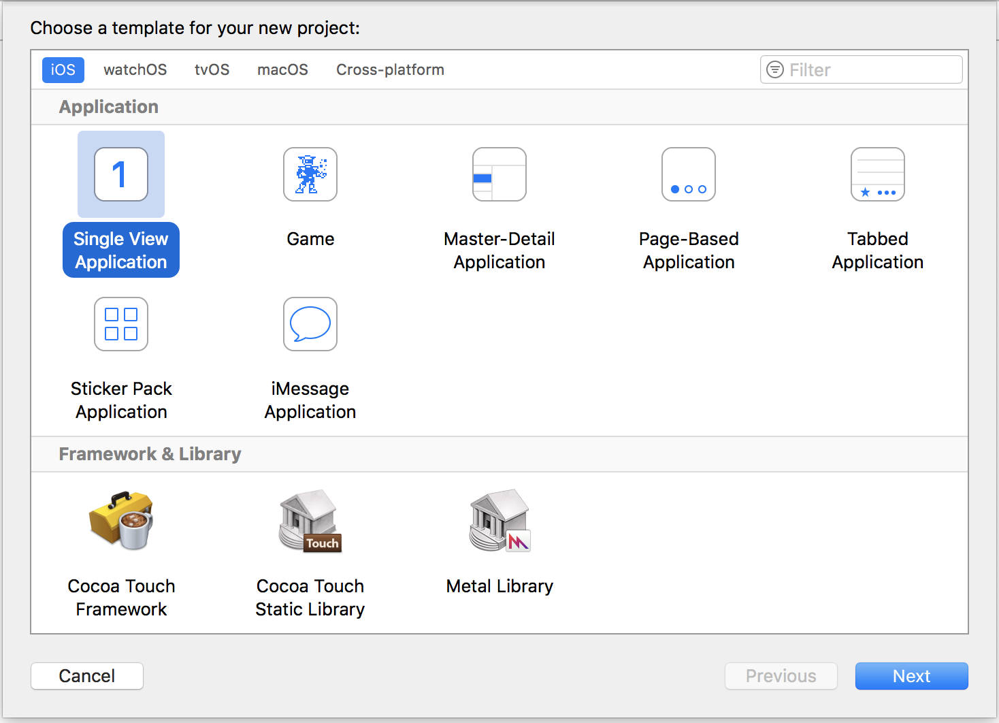
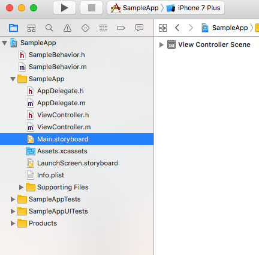
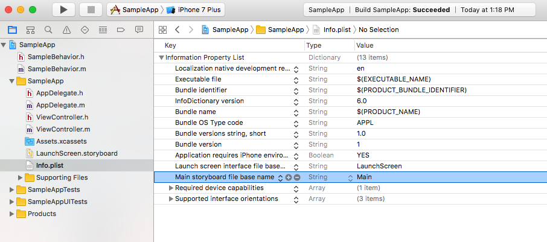
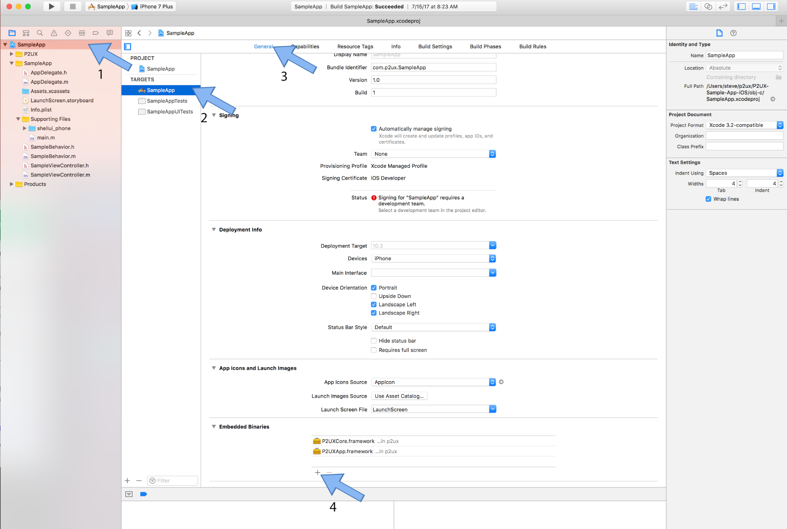
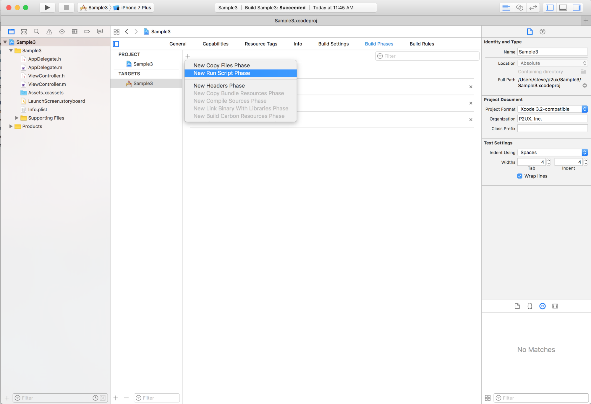
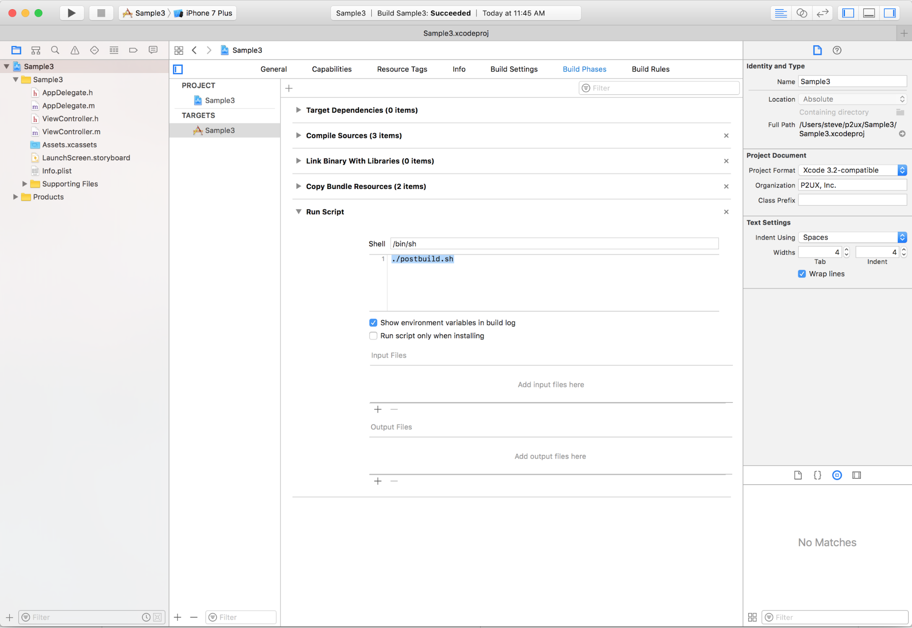
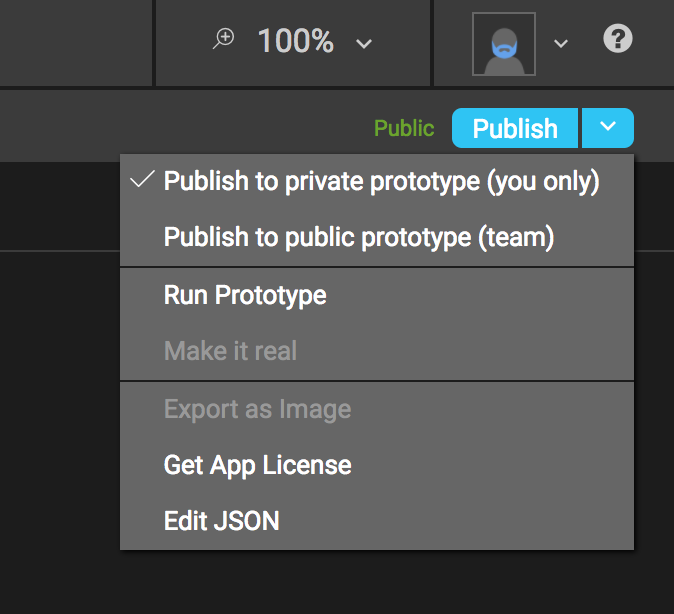
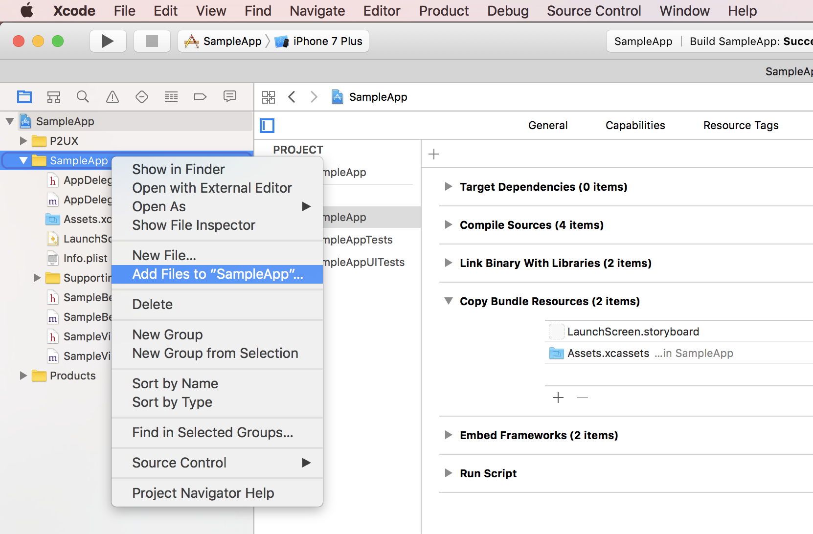
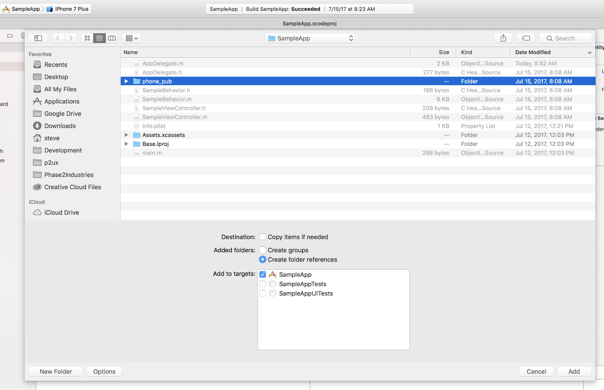

## Introduction


What follows is a detailed tutorial that walks developers through all of the steps involved in creating a customizable iOS or tvOS application using P2UX. Developers should be familiar with the Xcode integrated development environment for MacOS and either the Swift or the Objective-C programming languages for custom coding.

!!! note "Terminology"
    Throughout the P2UX documentation the “developer” refers to you, the reader who is developing an app with P2UX. The “designer” refers to the individual whose principal job is to create the appearance and style of the app and its visual components. “PRL” refers to the P2UX Rendering Library for iOS, which controls the creation and workflow of content created for the P2UX platform.

!!! note "Coding examples and code additions"
    In the coding examples below and throughout the documentation, changes and additions to be made by the developer are rendered with a blue highlight.

*P2UX versus the standard Xcode environment*

P2UX based applications for iOS are easy to customize and extend. Since the P2UX iOS rendering library is based on the native UIKit and other iOS primitives, writing custom business logic and integrating custom controls works much the same as it does when writing iOS applications using Xcode.
With the P2UX platform, Storyboards and XIB based User Interface (UI) definitions are no longer required. Instead, applications use P2UX Portable UX Bundles (PUB) either as embedded or dynamically accessed resources. Additionally, P2UX provides hooks to developers that allow them access to all of the components of P2UX, as well as the ability to fully customize instances of the application.

## Getting Started with P2UX and Xcode

*Objective-C or Swift*

P2UX native rendering libraries for iOS can be extended using either Objective-C or Swift. Developers are free to choose one or the other of these coding languages at any stage during the development process. The instructions below provide explicit reference to the proper use of either language in each applicable step that follows.

### Creating a new application

From the Xcode environment:

* Start the Xcode new project wizard by selecting File->New->Project.
* From the new project wizard select “Single View Application” as the starting point for your app.

* The rest of the options in the new project wizard are dependent on your application and the selection of either Swift or Objective-C.

### Connecting the PUB. Defining assets and custom behaviors

Now that the initial project is set up, make the necessary changes to include the PUB for the application.

* Remove the Storyboard

When Xcode creates a new project, it automatically generates a blank storyboard file called `Main.storyboard`. Rather than using storyboards to create the UI for your app, your app will use a PUB. To accomplish this, simply remove the `Main.storyboard` file from your project.

First, delete the file itself from your project (move to trash).


Next, in `Info.plist`, remove the key ==Main storyboard file base name==.

* Select the Info.plist file from the project navigator.
* From the editor on the right side, select the ==Main storyboard file base name== row.
* Double click on the word ==Main== from that row to edit it and delete the text, leaving the ==Value== field empty.
* Save the modified `Info.plist` file.


Finally, in the project navigator under “Deployment Info,” delete the text from “Main Interface” so that the text field is blank.

* Select the application name from the project navigator.
* From the right side editor, select the application target.
* Select the ==General== tab (shown highlighted in blue in the example screenshot)
* In the section titled ==Deployment Info==, select the text in the ==Main Interface== field and delete the text, leaving the field empty.
* Save the project changes.

Now, your app runs without a storyboard.

### Enabling P2UX iOS Frameworks

The next step in developing your project with P2UX is to include the P2UX frameworks for iOS. The latest frameworks can be downloaded from this site (INSERT URL ONCE AVAILABLE). Once the frameworks are downloaded:

* Unzip the framework files.
* Copy the P2UXCore.framework, P2UXApp.framework and postbuild.sh files into the root of your project directory.
* Add the framework files to your project in Xcode.
    * Select your project in the project navigator on the left side and then click on the ==Target== for your project.
    * Select the ==General== tab in your project target settings.
    * In the section labeled ==Embedded Binaries==, click the + button, then click the ==Add Other…== button from the drop down dialog.

    * Find the two framework files you added to your project folder, select them and then click ==Open==.
* Add `postbuild.sh` as a Build Phases script.
    * Select your project in the project navigator on the left side and then click on the ==Target== for your project.
    * Select the ==Build Phases== tab for your project.
    * Click the + button in the Build Phases window to add a new build step and select ==New Run Script Phase== from the drop down menu

    * In the new ==Run Script== phase, click in the shell script area and paste in the text ==./postbuild.sh==. This assumes you copied the `postbuild.sh` file from the earlier step into the root of your project.


*Removing unused binaries by running the* `postbuild.sh` *script*

The step above removes unused binaries from the P2UX frameworks for the current architecture. By default, P2UX frameworks are built as fat binaries, that is, they have compiled support (binaries) for actual iOS devices and for mac-based simulators all in the same framework bundle. This means that both Xcode simulators and real iOS devices use the same framework files when running the application.

The `postbuild.sh` script will now run at the end of the build process and remove the extra binary (depending on the target device for your build) from the framework bundled into your application. This step is required for submission of an application to iTunes.

## Moving the app from Builder to Xcode

* App License and AppDelegate

First, edit the AppDelegate files. Xcode automatically generates AppDelegate files when you create a project. These files are AppDelegate.h and AppDelegate.m if you are using Objective-C. The file is AppDelegate.swift if you are using Swift.

(Note, additions to be made to your code are rendered here and throughout the document in blue font.)

If your project is written in Objective-C, edit the `AppDelegate.h` file to look like this:
``` hl_lines="2"
#import <UIKit/UIKit.h>
@import P2UXApp;
@interface AppDelegate : UIResponder <UIApplicationDelegate, P2UXAppCreatorDelegate>
@property (strong, nonatomic) UIWindow *window;
@end
```
Edit the `AppDelegate.m` file to look like this:
``` hl_lines="6 7 8 9 10 11"
#import "AppDelegate.h"
@interface AppDelegate ()
@end
@implementation AppDelegate
- (BOOL)application:(UIApplication *)application didFinishLaunchingWithOptions:(NSDictionary *)launchOptions {
    NSString* appKey = @"xxxxx";
    NSDictionary* opts;
#if DEBUG
    opts = @{P2UXAppCreator_Opt_Env: P2UXAppCreator_Opt_Env_Stage};
#endif
    [P2UXAppCreator createApplicationWithKey:appKey opts:opts resources:nil delegate:self];
    return YES;
}
...
@end
```
If your project is written in Swift, edit the `AppDelegate.swift` file to look like this:
``` hl_lines="2 7 8 9 10 11 12 13"
import UIKit
import P2UXApp
@UIApplicationMain
class AppDelegate: UIResponder, UIApplicationDelegate, P2UXAppCreatorDelegate {
    var window: UIWindow?
    func application(_ application: UIApplication, didFinishLaunchingWithOptions launchOptions: [UIApplicationLaunchOptionsKey: Any]?) -> Bool {
        let appKey = "xxxxx";
        var opts : [AnyHashable : Any];
#if DEBUG
        opts = [
            P2UXAppCreator_Opt_Env: P2UXAppCreator_Opt_Env_Prototype]
#endif
        P2UXAppCreator.createApplication(withKey: appKey, opts: opts, resources: nil, delegate: self)
        return true
    }
    ...
}
```
The AppDelegate calls the `P2UXAppCreator` method `createApplication` using the appKey, which initializes the PRL with the application information. In this example, options are supplied to the `createApplication` method to use the prototype version of the application when the application is compiled for debugging. To use the production version of the application for debugging, remove the options.

Next, retrieve the app’s license. In Builder, to the right of the publish button are further options in a drop-down menu. Select ==Get App License== from the menu and a window will pop up with your app’s license. Copy the license.

In AppDelegate, replace the ==xxxxx== in the line that reads ==appKey = @”xxxxx";== with your app’s license (retrieved earlier from Builder.)

!!! note
	At this point the application setup is complete and the app should run successfully.

## The PUB and network connectivity

The next step in the  process requires developer awareness of the default PUB status and access to a network.

By default, the application accesses the PUB dynamically. This means that when the application is first installed, the P2UX rendering library (PRL) will authenticate the application key and then download the PUB before running the application content.

The first run of an application requires network connectivity. Otherwise, P2UX will return an error. The PUB’s default update policy is automatic. This means that the PRL will automatically check for updates each time the application runs. The library will also download any updates that are available, and then notify the user that the application will restart to apply any updates.

### Static Assets

In some cases, a developer may opt to use only static assets rather than require network access for an app. In this situation, the PUB can be added to the application as a collection of static assets. To achieve this, follow these steps:

!!! note
    This feature requires downloading your application PUB from Builder. This feature will be integrated as part of the P2UX Coordinator application for Mac OS

* In Builder, download the published PUB for application
    * Steps to download PUB will go here
* Unzip the PUB files and copy the assets into a folder inside your project directory.
* In Xcode, add the folder to the project.
    * From the project navigator, select the group folder with your application name.
    * Right click and select ==Add Files to ‘app name’==

    * From the dialog, click the ==Options== button in the bottom left corner and select ==Create folder References== from the ==Added folders== option

    * Select the folder containing the PUB assets and click the ==Add== button to add them to your project.
    
In the example, this folder is called `phone_pub`.

In order to incorporate these files into your project, as well as to adjust the resource use settings, you must change the AppDelegate file.

For projects in Objective-C, edit the `AppDelegate.m` file to look like this:   
``` hl_lines="13 14 15 16 17"
#import "AppDelegate.h"
#import "SampleBehavior.h"
@interface AppDelegate ()
@end
@implementation AppDelegate
- (BOOL)application:(UIApplication *)application didFinishLaunchingWithOptions:(NSDictionary *)launchOptions {
   
    NSString* appKey = @"xxxxx";
    NSDictionary *opts;
#if DEBUG
    opts = @{P2UXAppCreator_Opt_Env: P2UXAppCreator_Opt_Env_Prototype};
#endif    
    NSDictionary *resources = @[
    	@{P2UXApp_PackageAttrib_FormFactor: [NSNumber numberWithInteger:P2UXFormFactor_Phone], 
    	  P2UXApp_PackageAttrib_Type:P2UXApp_PackageType_Static, 
    	  P2UXApp_PackageAttrib_Package:@"phone_pub",
    	  P2UXApp_PackageAttrib_Update:P2UXApp_PackageUpdate_None}];
   
    [P2UXAppCreator createApplicationWithKey:appKey opts:opts resources:resources delegate:self];
    return YES;
}
@end
``` 
For projects in Swift, edit the `AppDelegate.swift` file to look like this:
``` hl_lines="14 15 16 17 18 19"
import UIKit
import P2UXApp
@UIApplicationMain
class AppDelegate: UIResponder, UIApplicationDelegate, P2UXAppCreatorDelegate {
    var window: UIWindow?
    func application(_ application: UIApplication, didFinishLaunchingWithOptions launchOptions: [UIApplicationLaunchOptionsKey: Any]?) -> Bool {
        let appKey = "xxxxx";
        var opts : [AnyHashable : Any];
#if DEBUG
        opts = [
            P2UXAppCreator_Opt_Env: P2UXAppCreator_Opt_Env_Prototype
        ]
#endif
        var phoneResources: [AnyHashable : Any] = [
            P2UXApp_PackageAttrib_FormFactor: P2UXFormFactor.phone,
            P2UXApp_PackageAttrib_Type: P2UXApp_PackageType_Static,
            P2UXApp_PackageAttrib_Package: "phone_pub",
            P2UXApp_PackageAttrib_Update: P2UXApp_PackageUpdate_None
        ]
       
        var resources : [Any] = [
            phoneResources
        ]
        P2UXAppCreator.createApplication(withKey: appKey, opts: opts,
        resources: resources, delegate: self)
        return true
    }
}
```

### Defining Custom Resource Attributes

If desired, the developer can define specific resource attributes for the app. These attributes define where the assets of the application are located and how those assets are updated.

The resources parameter is an array of objects. Each object in the array defines the PUB usage for a particular form factor (Phone, Tablet, TV) using key value pairs. If the application supports multiple form factors, create an object in the resources array for each form factor.

Customize the resource attributes according to the possibilities below:

| Resource Attribute | Description |
| --- | --- |
| P2UXApp_PackageAttrib_FormFactor | Defines which form factor the attributes reference.<br/><br/>**Possible Values:**<br/>P2UXFormFactor_Phone<br/>P2UXFormFactor_Tablet<br/>P2UXFormFactor_TV |
| P2UXApp_PackageAttrib_Type | Defines the type of resources for the form factor<br/><br/>**Possible Values:**<br/>P2UXApp_PackageType_Static<br/>P2UXApp_PackageType_Remote |
| P2UXApp_PackageAttrib_Package | Defines the name of the folder within the application bundle containing assets when the P2UXApp_PackageAttrib_Type is P2UXApp_PackageType_Static. |
| P2UXApp_PackageAttrib_Update | Defines how to update the application assets<br/><br/>**Possible Values:**<br/>P2UXApp_PackageUpdate_None<br/>P2UXApp_PackageUpdate_Auto<br/>P2UXApp_PackageUpdate_Manual |

After defining the resources, change the resources line in the app code from “nil” to “resources” (as highlighted in the example code above).

