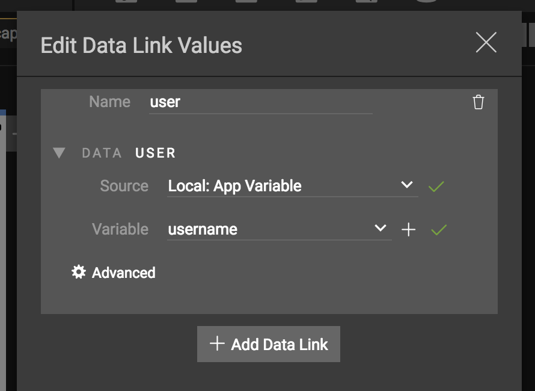

# Data Filters and Conditionals
Data linked to controls can be modified using a variety of filters or conditionals. Filters and conditionals can be provided directly in the assignment of data to a specific property on a control or as the result of a conditional. 

Currently the *Builder* product doesn't have a special built editor for working with filters or formatters other than working directly with the P2UX format. This guide helps explain how to manually enter filters and conditionals.

## Filtering Data
Filters can be used to apply math, formatting or just combine multiple values together to assign to a property of a component. In general, expressions, formatters and functions have specific delimiters used to indicate their use. 

To filter a value applied to a property of a component in *Builder*:

* Select the component in the Screen/Panel Editor.
* Click the ==Data== Tab from the right side of the editor
* From the ==Select Property== drop down, select the property of the component you want to apply the data to.
* From the ==Select Source== drop down for the property, select ==Filter: Data Expression==


* Next add at least one variable to use by clicking the ==With data:== link button
* From the ==Edit Data Link Values== dialog, select the variable for the property and give it a name by editing the name field (In this example the variable is given the name *user*), then click ==OK== to close the dialog.


!!! note 
    You can add more than one variable to the property and combine values in the filter or the conditional. Click the ==Add Data Link== button to add another data link.

* The expression is typed into the ==Expression== text field. This particular example shows the `user` variable being combined with the `status` variable before being assigned to the *label* property of a Text component. 

Example output would show: `user is offline`.


!!! note
    When creating a filter or conditional, variables are delimited using the notation **{{**name**}}**. Variables can be used without any specific expression syntax as well to just combine values together.


## Conditional Data
Conditionals can be used to change the resulting value by evaluating one or more variables and choosing a resulting value based on the outcome of the conditional evaluation. Just like with filters, conditionals refer to variables using the notation **{{**name**}}**. 

Conditionals use the typical programming operators for comparison:

| Operator | Description |
| --- | --- |
| == | Equal to |
| != | Not Equal to |
| >  | Greater than |
| <  | Less than |
| >=  | Greater than or equal to|
| <=  | Less than or equal to|
| && | And |
| \|\| | Or |

To conditionally assign a value to a property of a component in *Builder*:

* Select the component in the Screen/Panel Editor.
* Click the ==Data== Tab from the right side of the editor
* From the ==Select Property== drop down, select the property of the component you want to apply the data to.
* From the ==Select Source== drop down for the property, select ==Filter: Conditional Data==


* Next add at least one variable to use by clicking the ==With data:== link button
* From the ==Edit Data Link Values== dialog, select the variable for the property and give it a name by editing the name field (In this example the variable is given the name *user*), then click ==OK== to close the dialog.

* Add the conditional logic to the ==IF== expression box.

!!! note "Comparing String Values"
	If the variable to be evaluated is a string, single quotes should be used to delimit the variable and the string it is being compared to.
	Example:
	`'{{user}}'=='Robert'`
	
!!! note "Comparing Existence of a Variable"
    To evaluate whether or not a variable exists, use the keyword `null` in the conditional.
    Example: `{{user}}==null`
    
!!! note "Comparing Boolean values"
    To evaluate if a boolean value is true or false, use the numbers 1 or 0 in place of the words `true` or `false`. Example: `{{isconnected}}==1` to determine if the variable `isconnected` is true
    
* Finally add the results to the ==THEN== and ==ELSE== value text fields. The value can be an filtered expression or just a simple value.


## Advanced Filtering and Formatting  
In addition to the basic concatenation of variables into a single value, filters can also be used to format data by applying math, string handling or date formatting. These advanced expressions can be used directly in filters or in conditionals.

### Math Expressions
A math expression can be placed anywhere in a filtered data link or conditional string (if, then or else) to modify a value. Math expressions are delimited using **%=**expression**=%**. Parenthesis can be used to group math expressions within the delimiters. Also the end result of the expression can be formatted using traditional c-style printf notation. The math expression handler expects numeric input for the value. Only a single math expression can be evaluated within a set of math expression delimiters, but the expression can contain multiple variables as needed.  The syntax for the expression follows general programming math notation. To create a math expression, use the format: **%=**format,expression**=%**.

**Example Math Expression that converts a percent value:**
``` 
%={{pctusers}}*100=% 
```

**Example Math Expression that uses two variables and output formatting to limit the result of the expression to a single decimal point:**
```
Pct Users Online: %=%2.1f,{{numusers}}/{{totalusers}}*100=%%
```

!!! note
    The extra `%` at the end of this example is evaluated as a string and appended to the end of the result of the expression so that the value ends up something like `Pct Users Online: 80.1%`

** Example Math Expression used in the IF part of a conditional:**
```
%=({{value}}/100)=%>=1
```

### Timestamp Formatting
Timestamp formatting can be applied to values that represent a timestamp value in either integer form (seconds since 1970), or as a string that uses one of the following formats:

`yyyy-MM-dd'T'HH:mm:ssZZZZZ`<br>
`yyyy-MM-dd'T'HH:mm:ss`<br>
`yyyyMMdd'T'HH:mm:ss`<br>

Timestamp formatters are delimited using **#=**format**=#**

To use the date formatting associated with a timestamp value, the property for the text component must be ==timestamp==.

* Select the text component in the Screen/Panel Editor.
* Click the ==Data== Tab from the right side of the editor
* From the ==Select Property== drop down, select the ==timestamp== property of the text component you want to apply the data to.
* From the ==Select Source== drop down for the property, select ==Filter: Data Expression==
* In the ==Expression== text field, enter the format for the date.

Example Timestamp format:
```
#=h:mm a MM/dd/yyyy=#
```
Would produce the output: `9:22 AM 10/23/2017`

!!! note
    The format follows the unicode date formatting standard (<a href="http://www.unicode.org/reports/tr35/tr35-25.html#Date_Format_Patterns" target="_blank">click here to see list of supported format values</a.>).

### String Functions
Another modifier for values are string functions. They allow for manipulating or evaluating string attributes. String functions are delimited using the format: **[=**func(value)**=]**

*Supported Functions*

Function | Parameters | Description
--- | --- | ---
toupper	| string | convert the entire string to upper case
tolower	| string | convert the entire string to lower case
substr | string, integer | extract a substring from the supplied string, the second parameter is the number of characters to extract
strlen | string | returns the length of the supplied string as an integer
replaceall | string, string value, string replace | Replaces instances of the supplied value (2nd param) in the string (first param) with the replace value (3rd param)<br><br>Example: replaceall("my fun and exciting example", "fun", "lame") → output: "my lame and exciting example"
contains | string, string | Returns a true/false result based on whether or not the string contains the 2nd parameter string. This function is case sensitive.
capfirst | string | Capitalizes the first letter in the supplied string.
capall | string | Capitalizes every word found in the string. Words are separated by space.

Example String Function:
```
[=toupper({{user}})=] is online
```
Would produce the output: `ROBERT is online`

<div style="text-align:right"><sub><sup>Last Updated: Dec. 18, 2017<sup><sub></div>
